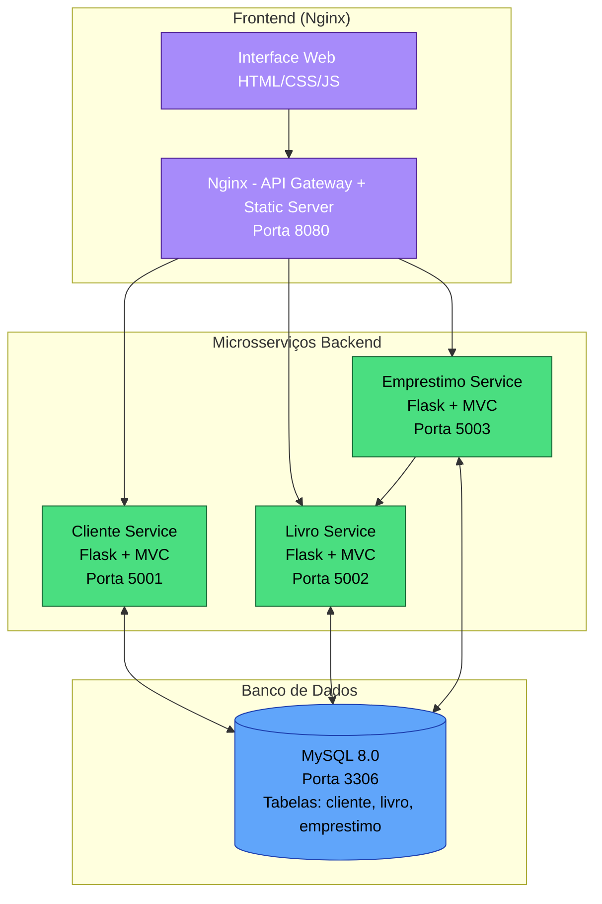

# 📚 Sistema Web de Biblioteca  
### Arquitetura de Microsserviços + MVC + Docker

---

## 📖 Visão Geral do Projeto
Esse projeto foi desenvolvido para a disciplina de Desenvolvimento Web 2 por Matheus Tenório e Filipe de Oliveira.

O **Sistema Web de Biblioteca** é uma aplicação desenvolvida com fins acadêmicos para aplicar conceitos modernos de **Engenharia de Software**, **Arquitetura de Sistemas** e **Desenvolvimento Web**. O sistema foi construído utilizando arquitetura baseada em microsserviços, onde cada domínio funciona de forma independente e se comunica através de **APIs REST**.

O sistema permite o gerenciamento completo de uma biblioteca, incluindo:

- 👤 Cadastro de clientes  
- 📘 Gerenciamento de livros  
- 🔄 Controle de empréstimos e devoluções  

Alem disso, o sistema inclui 3 entidades **(Clientes, Livros, Empréstimos)** sendo possível realizar operações CRUD **(CREATE - READ - UPDATE - DELETE)** em cada uma das entidades.

Este sistema foi feito para ser executado em sua IDE de preferência ou na Nuvem através do Cloud9 (AWS).

---

## ⚙️ Funcionalidades do Sistema

### 👤 Clientes
- Cadastrar cliente
- Listar clientes
- Editar dados
- Remover cliente

### 📘 Livros
- Cadastrar livros
- Consultar acervo
- Alterar disponibilidade
- Remover livros

### 🔄 Empréstimos
- Registrar empréstimos
- Associar cliente a livro
- Registrar devoluções
- Excluir empréstimos

---

## 🛠 Tecnologias Utilizadas

### Backend:
- Python
- Flask
- API REST
- Arquitetura MVC

### Frontend:
- HTML5
- CSS3
- JavaScript
- Nginx

### Banco de Dados:
- MySQL

### DevOps & Infraestrutura:
- Docker
- Docker Compose
- Nginx

### Arquitetura:
- Microsserviços
- MVC
- Comunicação HTTP entre serviços

### CI/CD
- GitHub Actions
---

## 🏗 Arquitetura do Sistema

O sistema foi dividido em múltiplos serviços independentes (sendo os 3 principais: Cliente - Livro - Empréstimo):

### 🔹 Frontend
Interface visual responsável pela interação com o usuário e envio das requisições para as APIs.

### 🔹 Cliente Service
Gerencia operações relacionadas aos usuários da biblioteca.

### 🔹 Livro Service
Responsável pelo controle do acervo e disponibilidade dos livros.

### 🔹 Emprestimo Service
Controla empréstimos e devoluções, integrando clientes e livros.

### 🔹 MySQL Database
Armazena permanentemente os dados do sistema.

### 🔹 Nginx
Funciona como **API Gateway**, centralizando o acesso aos microsserviços.


Cada microsserviço possui:

- Aplicação Flask independente  
- Estrutura MVC própria  
- Dockerfile individual  
- Dependências isoladas  

---

##  CI/CD (GitHub Actions)

O pipeline roda automaticamente em cada push:

### Etapas:

**1. Build**
- Criação das imagens Docker dos serviços

**2. Integração**
- Sobe todo o sistema com Docker Compose
- Aguarda inicialização

**3. Testes**
- Verifica frontend
- Testa APIs dos microsserviços via HTTP

Se tudo funcionar:
 pipeline aprovada  
 qualquer falha quebra o build

---

## 🚀 Processo de Desenvolvimento

O projeto foi desenvolvido seguindo etapas progressivas:

1. Modelagem do domínio da biblioteca  
2. Definição das entidades principais  
3. Criação do banco MySQL  
4. Desenvolvimento do primeiro microsserviço  
5. Implementação do padrão MVC  
6. Replicação da arquitetura para os demais serviços  
7. Implementação das APIs REST  
8. Desenvolvimento do frontend  
9. Integração frontend ↔ backend  
10. Containerização com Docker  
11. Ultilização do Docker Compose para dependências  
12. Configuração de rede entre containers  
13. Implementação do Nginx como gateway  
14. Testes de comunicação entre serviços  
15. Deploy em ambiente Cloud9/AWS  

---

# ▶️ Como Executar o Sistema

Este guia explica **passo a passo** como rodar o sistema completo da Biblioteca utilizando **Docker**, funcionando em qualquer computador sem necessidade de instalar dependências manualmente.

---

##  Pré-requisitos:

Antes de iniciar, é necessário possuir instalado em sua máquina ou ambiente:

✅ Docker  
✅ Docker Compose  
✅ Git (opcional, para clonar o projeto)

---

## Executando:

**Clonar o Repositório**
```
git clone https://github.com/matheus1tenorio/sistema-web-biblioteca.git
```

**Acessar a Pasta Certa**
```
cd sistema-web-biblioteca
```

**Subir o Sistema**
```
docker compose up --build
```

**Fechar o Sistema**
```
docker compose down
```

**Verificar Containers (Opcional)**
```
docker ps
```

**Acessar o Sistema**
```
http://localhost:8080/index.html
```

---

## 🏗️ Diagrama

O sistema segue uma **arquitetura de microsserviços** com separação clara de responsabilidades.




Descrição Detalhada do Fluxo

- Usuário acessa http://localhost:8080 → Nginx serve arquivos estáticos e proxyia APIs.
- Autenticação é feita via Cliente Service (JWT gerado e validado).
- Empréstimos consultam Livro Service para verificar/atualizar disponibilidade.
- Todos os serviços compartilham o mesmo banco MySQL via rede Docker.
- Setas mostram o fluxo de requisições e comunicação entre serviços.

---

## 📁 Estrutura Completa de Pastas do Projeto

```bash
└───sistema-web-biblioteca
    │   .gitignore
    │   docker-compose.yml
    │   README.md
    │   
    ├───.github
    │   └───workflows
    │           ci-cd.yml
    │           
    ├───cliente-service
    │   │   app.py
    │   │   auth.py
    │   │   config.py
    │   │   Dockerfile
    │   │   requirements.txt
    │   │   
    │   ├───controllers
    │   │       cliente_controller.py
    │   │       
    │   ├───models
    │   │       cliente_model.py
    │   │       
    │   └───routes
    │           cliente_routes.py
    │           
    ├───database
    │       init.sql
    │       
    ├───emprestimo-service
    │   │   app.py
    │   │   config.py
    │   │   Dockerfile
    │   │   requirements.txt
    │   │   
    │   ├───controllers
    │   │       emprestimo_controller.py
    │   │       
    │   ├───models
    │   │       emprestimo_model.py
    │   │       
    │   └───routes
    │           emprestimo_routes.py
    │           
    ├───frontend
    │   │   base.html
    │   │   cadastro.html
    │   │   Dockerfile
    │   │   emprestimos.html
    │   │   esqueci-senha.html
    │   │   index.html
    │   │   livros.html
    │   │   login.html
    │   │   nginx.conf
    │   │   redefinir-senha.html
    │   │   usuarios.html
    │   │   
    │   ├───css
    │   │       style.css
    │   │       
    │   ├───imagens
    │   │       Adobe Express - file.jpg
    │   │       pessoa-lendo-livro-biblioteca.jpg
    │   │       
    │   ├───js
    │   │       auth.js
    │   │       clientes.js
    │   │       emprestimos.js
    │   │       livros.js
    │   │       main.js
    │   │       theme.js
    │   │       
    │   └───videos
    │           biblioteca1.mp4
    │           
    └───livro-service
        │   app.py
        │   config.py
        │   Dockerfile
        │   requirements.txt
        │   
        ├───controllers
        │       livro_controller.py
        │       
        ├───models
        │       livro_model.py
        │       
        └───routes
                livro_routes.py
```
